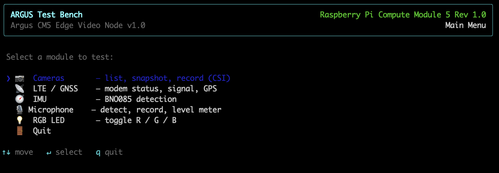

# Argus CLI — Test Bench & Manager

An interactive terminal app ([Ink](https://github.com/vadimdemedes/ink)) for testing the
peripherals on the **Argus CM5 Edge Video Node v1.0** board. It runs on a Raspberry Pi CM5
(RPi OS Bookworm 64-bit Lite) and exercises each module from one menu: cameras, the
LTE/GNSS modem, the IMU, the I2S microphone, and the RGB LED.



## Quick start

```bash
npm install
npm run build        # tsc -> dist/   (also the typecheck)
node dist/cli.js     # or: npm start

# Dev (no build step, runs the TS directly):
npm run dev

# Develop/preview on a non-Pi host (macOS, etc.) with fixture data:
ARGUS_MOCK=1 npm run dev
```

Install it as the `argus` command on the Pi with `npm link` (or `npm i -g .`).

Navigation: `↑↓` move, `↵` select, `q`/`Esc` go back, `q` on the home menu quits.

## Modules & how each is driven

| Module                  | Detect                                                    | Actions                                | Underlying tool                                  |
| ----------------------- | --------------------------------------------------------- | -------------------------------------- | ------------------------------------------------ |
| **Cameras** (CSI + USB) | `rpicam-hello --list-cameras` + `v4l2-ctl --list-devices` | snapshot, record (res/fps/duration)    | CSI: `rpicam-still`/`rpicam-vid` · UVC: `ffmpeg` |
| **LTE / GNSS**          | `lsusb` (SimCom `1e0e:9011`) + `/dev/ttyUSB*`             | live signal, GPS fix                   | telemetry JSON + NMEA on `ttyUSB1`               |
| **IMU**                 | `i2cdetect -y 1` (BNO085 `0x4A`/`0x4B`)                   | live quaternion / Euler / linear accel | `i2c-tools` + Python BNO08x helper               |
| **Microphone**          | `arecord -l`                                              | live level meter, record to WAV        | `arecord` (ALSA)                                 |
| **RGB LED**             | `pinctrl get`                                             | toggle R/G/B, all on/off               | `pinctrl` (raspi-utils)                          |

### Notes per module

- **Cameras** come in two kinds, shown in one list. **CSI** (MIPI) cameras use rpicam-apps.
  **UVC** USB cameras are V4L2 devices (rpicam can't drive them): enumerated with `v4l2-ctl`
  (the capture node is auto-picked, skipping the metadata node) and captured with `ffmpeg`
  (MJPG input → JPG snapshot / libx264 MP4). Needs `v4l-utils` + `ffmpeg`.
- **Video recording** (CSI) uses `rpicam-vid --codec libav` → MP4. The Pi 5 / CM5 has no hardware
  H.264 encoder, so libav (software) does the encoding. The Lite image ships
  `rpicam-apps-lite` which lacks libav — if recording errors with "Unrecognised codec libav",
  install the full package: `sudo apt install rpicam-apps`. Snapshots work either way.
- **LTE signal** is read from the connection-manager daemon's atomic telemetry at
  `/run/sim7600-lte/telemetry.json` — the CLI never opens the AT port (`ttyUSB2`), which the
  daemon owns. If telemetry is missing, start `sim7600-lte.service`.
- **GPS** reads NMEA read-only from `/dev/ttyUSB1`. If no sentences arrive, GPS likely needs
  enabling on the modem (`AT+CGPS=1`); GNSS is active by default per the board straps.
- **IMU live data** spawns [python/bno085_read.py](python/bno085_read.py), which drives the
  Adafruit BNO08x library and streams JSON back to the CLI. Needs `python3` plus
  `adafruit-circuitpython-bno08x` and `adafruit-blinka`. It reads at whichever address
  detection found (`0x4A` or `0x4B`); press `d` on the IMU screen to start.
- **Microphone (SPH0645)** is a quiet I2S MEMS mic with no hardware gain, so the CLI captures
  the native S32 stream (preserving the low bits) and applies a software gain — both to the
  live meter and to recordings, which it downmixes to a normal-loudness 16-bit WAV (picking the
  channel the mic actually sits on). Tune with `ARGUS_MIC_GAIN` (default 16; lower it if the
  meter pegs/clips).
- **RGB LED** is active-HIGH (R=GPIO12, G=GPIO21, B=GPIO16). `pinctrl` persists the pin state
  after exit, so toggles stick.
- Captures are written to `$ARGUS_CAPTURE_DIR` (default `~/argus-captures`).

## Architecture

```
src/
  cli.tsx              entry — render(<App/>)
  app.tsx              screen router + global keys
  config/hardware.ts   single source of truth (pins, addrs, paths, USB ids)
  lib/                 exec wrappers, platform/mock detection, format, NMEA parser
  hardware/            HAL — pure async functions, shell out, return typed results (no React)
  components/          Header, Table, StatusBadge, LogView, LevelMeter, KeyHints
  screens/             one Ink screen per module
  mocks/fixtures.ts    captured tool output (mock mode + unit tests)
test/                  parser unit tests + ink-testing-library UI smoke tests
```

`src/hardware/*` never imports React; screens render the typed results and show a calm
"not available / tool missing" state when a tool or device is absent. That separation is what
lets the whole UI run on macOS via `ARGUS_MOCK` (auto-on off-Linux, force with `ARGUS_MOCK=0/1`).

## Tests

```bash
npm test
```

- Parser tests cover `rpicam --list-cameras`, `v4l2-ctl` (devices + formats), `lsusb`,
  `i2cdetect`, `arecord -l`, `pinctrl get`, PCM RMS, and the NMEA parser against fixtures in
  `src/mocks/`.
- UI smoke tests render every screen in mock mode and assert the expected data appears.

---

## Original requirements (design brief)

> Using the Ink library, build a CLI tool that can test the Argus Board, installed on a
> Raspberry Pi CM5 (RPi OS Bookworm 64-bit Lite). Drivers are assumed installed via `../install.sh`.

- **Camera (per source, up to 3: UVC USB + 2 CSI):** list cameras, take pictures, record video
  with settings (fps, resolution).
- **4G/LTE SIM7600G:** detect (lsusb), read CSQ, read GPS data.
- **IMU:** detect (i2c address), read data.
- **Mic:** detect, record audio with visualizer.
- **RGB LED:** turn lights on/off.
